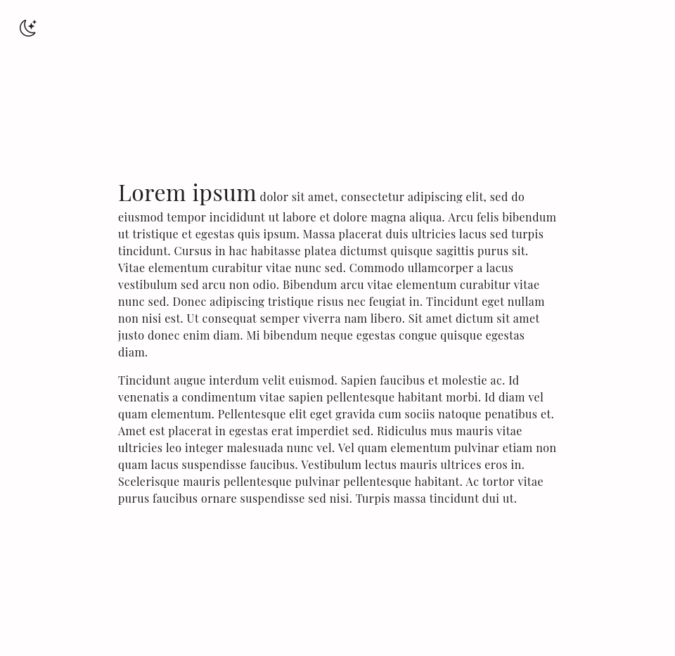
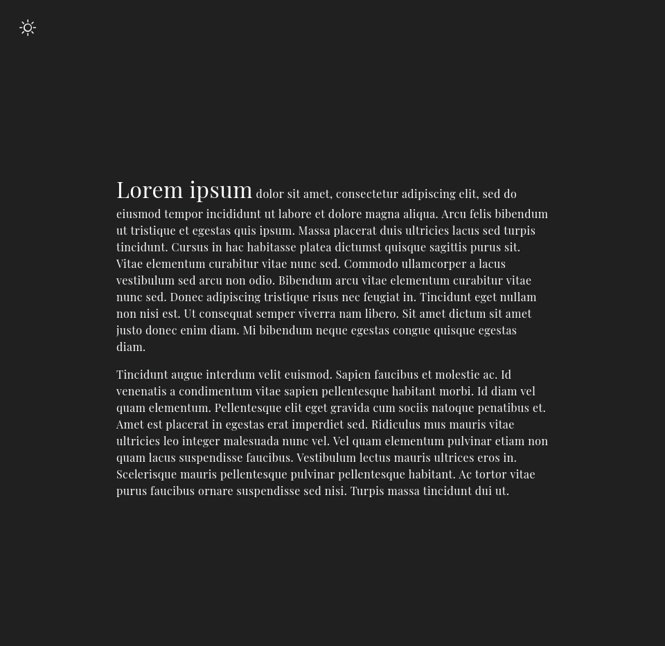

# Light/Dark Theme Demo

## Roadmap

- [X] Set initial theme to user-preferred theme
- [ ] Save selected theme to local storage
- [ ] Media queries for mobile-friendliness

## Acknowledgements

- [Bootstrap Icons](https://icons.getbootstrap.com/) for the icons on the theme switcher button
